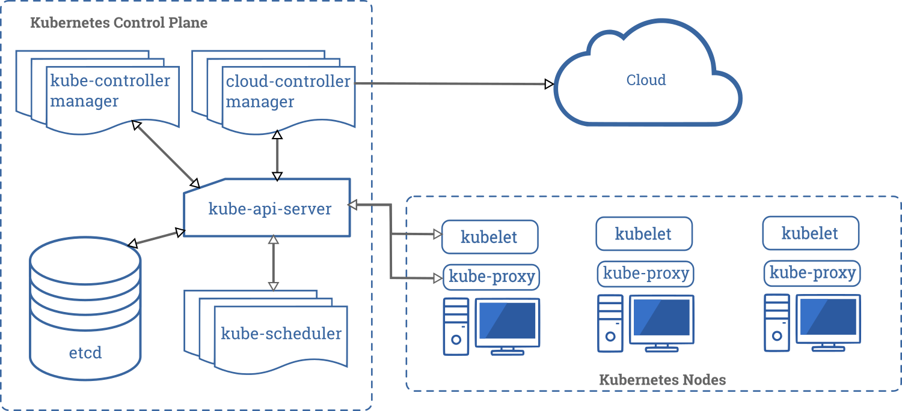
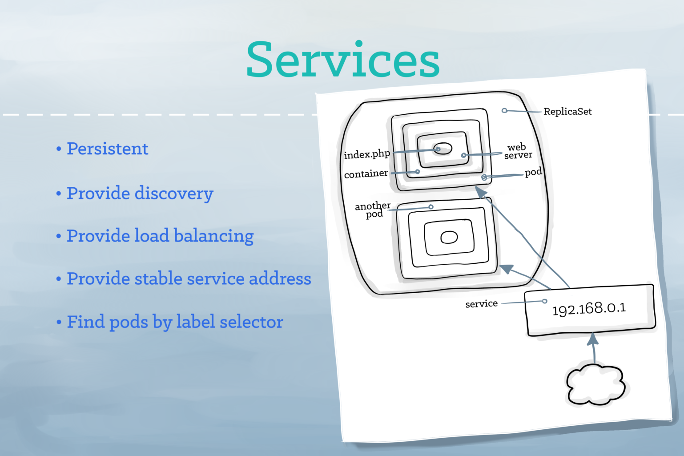

---

title: Kubernetes Overview
subtitle: Understanding the overview of Kubernetes
date: '2020-07-01'
categories: ['kubernetes', 'devops']
keywords: ['kubernetes', 'devops', 'overview', 'series', 'series', 'part_1', 'overview']
slug: kubernetes-overview
cover: './img/kubernetes.png'
type: 'BlogPost'

---

__This is the first part of the Kubernetes series. In this part I will surficially touch things realted to Kubenetes quickly.__

# Evolution Of Hosting

Traditionally, applications used to run on one or more `Physical Servers`. The main drawback was that they did not scale well as resources were not utilized to the maximum. `Virtual Machines` solved the problem and enhanced security of applications by providing isolated environments which enabled adoption of distributed systems tremendously. Then, with the large number of applications running in the Virtual Machines, maintenance started to become cumbersome. Now there are `Containerization` technologies which solved the problems of Virtual Machines by abstracting and enhancing their entire functionalities. `Kubernetes` has made it extremely easy to manage the `Containerized Applications`. 

# Kubernetes Architecture

# Kubernetes Objects
- Cluster is the pool of compute, storage, and network resources.
- Node is a host machine running within the Cluster.
- Namespace is the logical partitions of a Cluster.
- Pod is the basic unit of deployment.
- Labels are key-value pairs for identification and service discovery.
- Services identifies a set of Pods using Label selectors.
- Replication Sets ensures Pod's availability and scalability.
- Deployment manages Pod's lifecycle.
- Volume provies storage capability.
- Ingress exposes HTTP and HTTPS routes from outside the Cluster to Services.

# Core Processes
- `kube-controller-manager` manages other processes regulates the states of the `Kubernetes`. 
- `kube-apiserver` is the implementation of the `Kubernetes API`.
- `kube-scheduler` watches for newly created `Pods` with no assigned `Node`, and selects a Node for them to run on.
- `kubelet` communicates with the `Master Node` or the `Controller`.
- `kube-proxy` is a `Network Proxy` which reflects Kubernetes networking services on each Node.

# High Level Overview Of Kubenetes

# Namespace 

# Service

# Volume

# An Example Of How Request Flows In Kubernetes

# Example of Request Flow via Pod

# Review
**Kubernetes** is a large system with many parts functioning as a unit. 
Although it has simplified managing containerized distributed application, it is recommended to understand it very well befor using it production.

__I will share about [Kubernetes Objects](https://codeanit.com/posts/kubernetes-objects) next.__